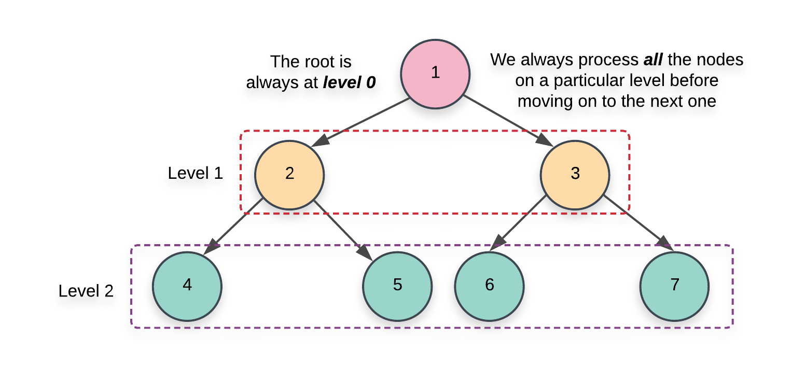
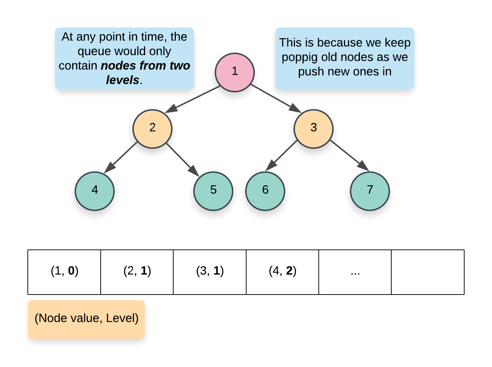
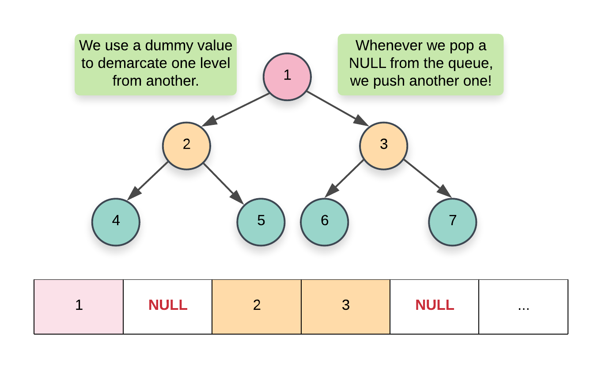
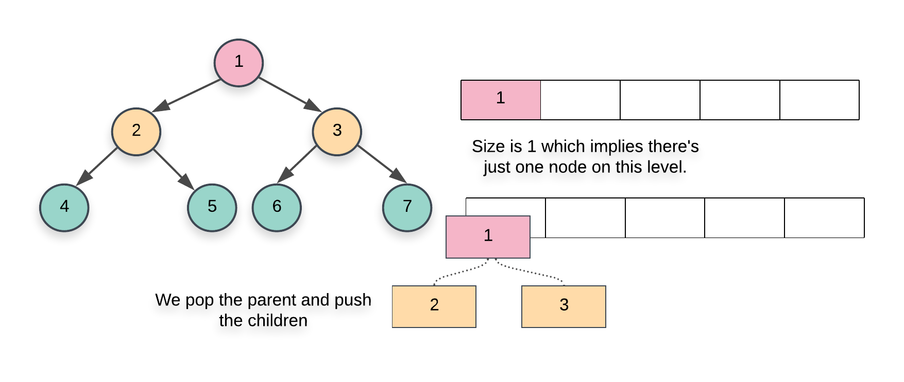
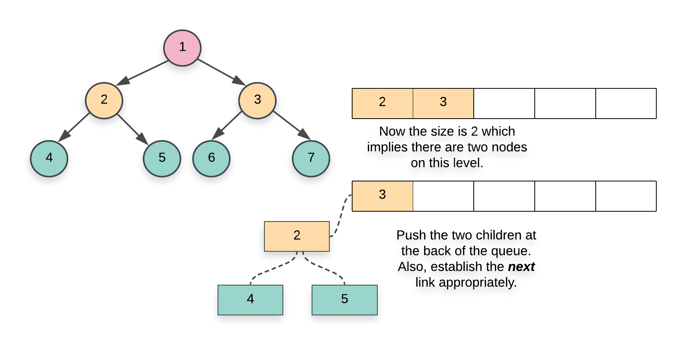

# Leetcode - 116 Populating next right pointers in each node

You are given a perfect binary tree where all leaves are on the same level, and every parent has two children. The
Binary the has the following definition:
```
struct Node {
  int val;
  Node *left;
  Node *right;
  Node *next;
}
```
Populate each next pointer to point to its next right node. If there is no next right node, the next pointer should be
set to `NULL`.
Initially, all next pointers are set to `NULL`.

## Example 1:


Input: root = [1,2,3,4,5,6,7]
Output: [1,#,2,3,#,4,5,6,7,#]
Explanation: Given the above perfect binary tree (Figure A), your function should populate each next pointer to point to its next right node, just like in Figure B. The serialized output is in level order as connected by the next pointers, with '#' signifying the end of each level.

## Solution

### Approach 1: Level order traversal
#### Intuition
There are 2 basic kinds of traversals on a tree or a graph. One is where we explore the tree in a dpth first manner i.e.
one branch at a time. The other one is where we traverse the tree breadth-wise IE we explore one lvel of the tree before
moving on the the next one. For trees, we have further classifications of the depth first traversal approach call
`preorder` `inorder` and the `postorder` traversals. Breadth first approach to exploring a tree is based on the concept
of the `level` of node. The `level` of a node is its depth or distance from the root node. We process all the nodes on
one level befre moving on to the next one.


Now that we have the basics out of the way, it's pretty evident that the problem statement strongly hints at a breadth
first kind of a solution. We need to link all the nodes together which lie on the `same level` and the level order or
breadth first traversal gives us access to all such nodes.

#### Algorithm
1. initialize a queue, which will be making use of during our trversal. There are multiple ways to implement the level
   order traversal especially when it comes to identifying the level of a particular node.
  1. we can add a pair of (node, level) to the queue and whenever we add the children of a node, we add (node.left,
     parent_level + 1) and (node.right, parrent_level + 1). This approach wouldn't be very efficient for our algorithm
     since we need all the nodes on the same level and would need another datastructure just for that.


  2. A more memory efficient way of segregating the same level nodes is to use some demarcation between the levels.
     Usually, we insert a `NULL` entry in the queue which marks the end of the previous level and the start of the next
     level. This is a great approach but again, it would still consume some memory proprtional to the number of levels
     in the tree

  3. The approach we will be using here would have a nested loop structure to get around the requirement of `Null`
     pointer. Essentially, at each step, we record the size of the queue and that always corresponds to all the node on
     a particular level.Once we have this size, we only process these many elements and no more. By the time we are done
     processing size number of elements, the queue would contain all the nodes on the next level.
2. We start off by adding the root of the tree in the queue. Since there is just one node on the level 0, we don't need
   to establish any connections and can move onto the while loop.

  ```ruby
   until q.empty? do
    size = q.size
    (0...size).each do |i|
      node = q.shift

      node.next = q[0] if i < size -1

      node.left && q << node.left
      node.right && q << node.right
    end
  end

  ```

3. The first `while` loop from essentially iterates over each level one by one and the inner for loop iterates over all
   the nodes on the particular level. Since we have access to all the nodes one the same level, we can establish the
   next pointers easily.
4. When we `pop` a node inside the `for` loop from the pseudocode above, we add its children at the back of the queue.
   Also, the element at the head of the queue is the next element in order, on the current level. So, we can easily
   establish the new pointers


```ruby
def connect(root)
  return root unless root

  # initial a queue data which contains just the root of the tree
  q = [root]

  # Outer while loop which iterates over each level
  until q.empty? do
    # Note the size of the queue
    size = q.size

    # Iterate over all the nodes on the current level
    (0...size).each do |i|
      # Pop a node from the front of the queue
      node = q.shift

      # This check is important. We don't want to establish any wrong connection.
      # The queue will contain node from 2 levels at most at any point in time.
      # This check ensures we only don't establish next pointer beyond the end of a level
      node.next = q[0] if i < size -1

      # Add the children, if any to back of the queue
      node.left && q << node.left
      node.right && q << node.right
    end
  end
  root
end
```
#### Complexity

- Time conlexity: O(n) since we process each node exactly once. Note that processing a node in this context means
  popping the node from the queue and then establising the next pointer
- Space complexity: O(N). This is a perfect binary tree which mean the last level contains N/2 nodes. The space
  complexity for breadth first traversal is the space occupied by the queue which is dependent upone the maximum number
  of node in particlar leve. So in this case, the space complexity would be O(N)
