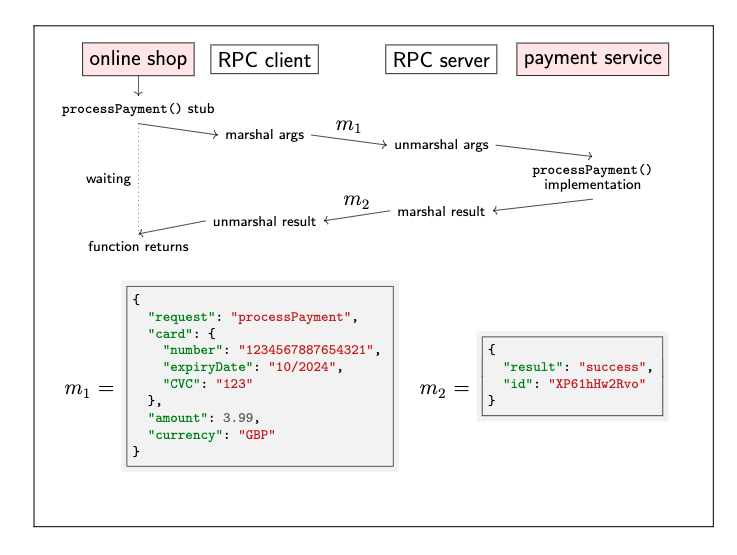

# Remote Procedure Call (RPC)

```ruby
card = Card.new
card.card_number = "1234 5678 8765 4321"
card.expiry_date = '11/2023'
card.cvv = '123'


result = payment_service.process_payment(card, 3.99, Currency.AUD) # Implementation of this fuction is on onther node
full_fill_order if result.success?
```

The actual implementation of process_payment - the logic that communicates with the card network and the banks - does
not exist in the code of the shop: it's part of the payments service which is another program running on another node
belonging to a different company/service.
This type of interaction, where code on one node appears to call a function on another node is called **Remote Procedure
Call - RPC**. The software that implements RPC is called and RPC framework or middleware - not all middleware is based
on RPC, there is also middleware that uses different communication models.

When an application wishes to call a function on another node, the RPC framework provides a stub in its place which have
sametype signature as a real function but instead of executing the real function, it endcodes the function arguments in
a message and sends that message to the remote node asking for that function to be called.
The process of endcoding the function arguments is known as *marshalling*.



- The sending of the message from the RPC client to the RPC server may happen over HTTP(web service) or one of a range
  of different network protocols maybe used
- On thge server side, the RPC framework unmarshals(decodes) the message and calls the desired function with the
  provided arguments. When the function returns, the same happens in reverse: the function's return value is marshalled,
  set as a message back to the client, unmarshalled by the client and returned by the stub -> might be similar with
  executed locally
- Difficulty:
  - Many things can go wrong as networks and note might fails
    - if the client sends an RPC request but receives no response, it doesn't know whether or not the server received
      and processed the request. It could resend the request if it doesn't know whether or not the server received and
      processed the request, but that might cause the request to be performed more than once, there is no guarantee that
      the retried messages will get through either.  -> timeout
Many variants of RPC have been developed
  - SunRPC/ ONC RPC
  - CORBA
  - Microsoft's Dcom and Java RMI
  - SOAP: RPC using XML and HTTP
  - Thrift
  - gRPC
  - REST
  - Ajax

- RESTful:
 - Communication is stateless: each request is selft contained and independent from other request
 - Resource: objects that can be inspacted and manipulated - are presented by URLs
 - The state of a resource is updated by making a HTTP request with a standard method type such as POST or PUT the
   appropriate URL
- RESTful APTs and HTTP-based PRC originated on the web, they are now also commonly used with other types of client(EG:
  mobile apps) or server to server communication

- Service-oriented architecture(SOA / Microservices): Splitting a large software application into multiple services
   on (multiple nodes) that communicate via RPC
- Different services implemented in different language:
  - Interoperability: datatype conversions
  - Interface Difinition Language(IDL): Language-independent API specicification
