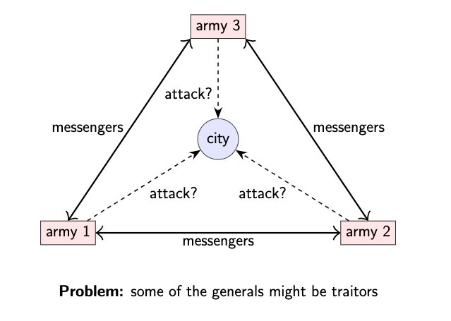
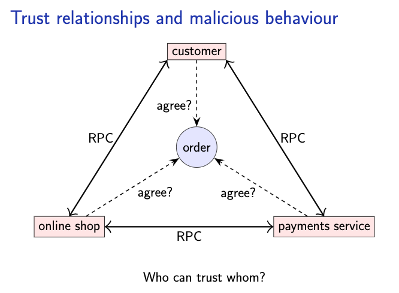

# The Byzantine generals problem
The Byzantine generals problem has a similar setting to [the two generals problem](./the_two_generals_problem.md). Again we have armies wanting to capture a city, though in this case there can be three or more. Again generals commnunicate by messengers, although this time we assume that if a message is sent, it is always delivery correctly.

The challenge in the Byzantine setting is that some generals might be traitors: that is, they might try to delibrately
and maliciously mislead and confuse the other generals. We call the traitors malicious, and the others honest. One
example of such malicous behavior is shown on pic 1

Generals who might lie

General 1                   General 2                                General 3
    |                          |                                        |
    |---------attack!-------------------------------------------------->|
    |---------attack!----------|---General 1 said retreat!------------->|

From general 3's point of view, this is indistinguishable

General 1                   General 2                                General 3
    |                          |                                        |
    |---------attack!-------------------------------------------------->|
    |--------retreat!----------|---General 1 said retreat!------------->|

The honest generals don't know who the malicious generals are but the malicous generals may collude and secretly
coordinate their actions. We might even assume that all of the malicious generals are controlled by an evil adversary.
The Byzantine generals problem is then to ensure that all honest general aggree on the same plan(eg: whether to attack
or retreat). By definition, it's impossible to specify what the malicious generals are going to do, so the best we can
manage is to get the honest generals to agree.

The Byzantine generals problem.
  - Each general is either malicious or honest
  - Up to f generals might be malicous
  - Honest generals don't know who the malicious ones are
  - The malicious generals may collude
  - Nevertheless, honest generals must agree on plan

  - Theorem need 3f + 1 generals in total to tolerate f malicious generals (i.e < 1/3 may be malicious)
  - Cryptography - digital signatures helps but problem remains hard

Real distributed systems do often involve complex trust relationships. For example, a customer needs to trust an online
shop to actually deliver the goods they ordered, although they can dispute the payment via their bank if the goods never
arrive or they get charge too much. But if an online shop somehow allowed customers to order goods without paying for
them, this weakness would no doubt be exploited by fraudsters, so the shop must assume that customers are potentially
malicious. On the other hand, for RPC between services belonging to the shop, running in the same datacenter, one
service can probably trust the other services run by the same company. The payments service doesn't fully trust the
shop, since someone might setup a fraudulent shop or use stolen credit card numbers, but the shop probably does trust
the payment service to agree on any order that is placed. The Byzantine generals problem is a simplification of such
complex trust relationships, but it is a good starting point for studying system in which some participants might behave
maliciously.

